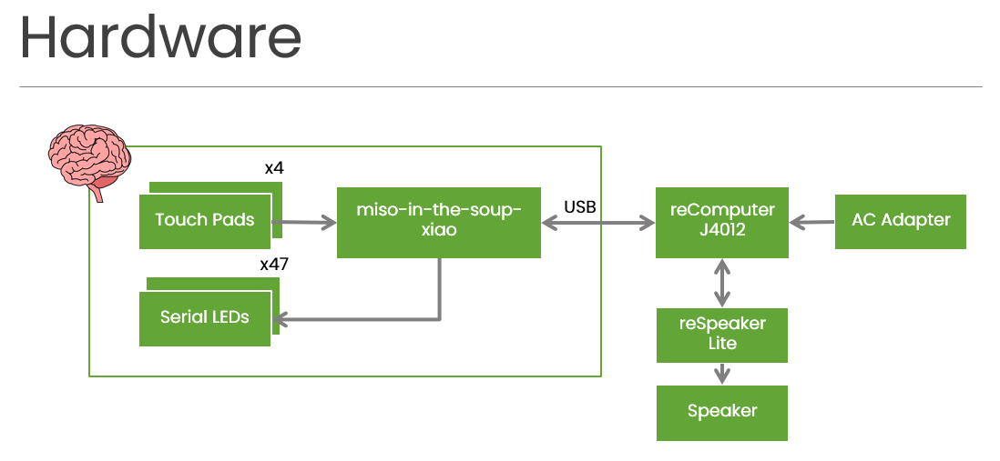

# miso-in-the-soup

LLM Brain in the soup

## Usage

### X86

```sh
$ docker stop $(docker ps -q)
$ docker rm $(docker ps -q -a)
```

```sh
$ docker run -d -v ollama:/root/.ollama -p 11434:11434 --name ollama ollama/ollama
```

```sh
$ python3 miso.py
```

### DGX Spark

#### Setup

Clone the repository:

```sh
$ git clone --depth 1 https://github.com/karaage0703/miso-in-the-soup.git
$ cd miso-in-the-soup
```

Install dependencies with uv:

```sh
$ uv sync
```

Download Noto Sans JP font from [Google Fonts](https://fonts.google.com/noto/specimen/Noto+Sans+JP) and place `NotoSansJP-Regular.ttf` in the `fonts/` directory.

#### Run

```sh
$ uv run python miso_spark.py
```

## Ogaki Mini Maker Faire 2024

### Hardware

<a href="media/1.png"></a>

* [reComputer J2012](https://www.seeedstudio.com/reComputer-J4012-p-5586.html)
* [AC Adapter 19V 4.74A](https://www.sengoku.co.jp/mod/sgk_cart/detail.php?code=EEHD-5RUL)
* [AC Adapter Cable](https://www.sengoku.co.jp/mod/sgk_cart/detail.php?code=EEHD-4J44)
* [reSpeaker Lite](https://www.seeedstudio.com/ReSpeaker-Lite-Voice-Assistant-Kit-Full-Kit-of-2-Mic-Array-pre-soldered-XIAO-ESP32S3-Mono-Enclosed-Speaker-and-Enclosure.html)
* [Mono Enclosed Speaker](https://www.seeedstudio.com/Mono-Enclosed-Speaker-4R-5W-p-5931.html)
* [miso-in-the-soup-xiao](https://github.com/matsujirushi/miso-in-the-soup-xiao)

### Setup

```sh
$ git clone --depth 1 https://github.com/karaage0703/miso-in-the-soup.git
$ cd miso-in-the-soup
```

```sh
$ pip install pyserial
$ sudo adduser $USER dialout
```

* [VOICEVOXセットアップ](https://zenn.dev/karaage0703/articles/c616475d67a531#voicevox%E3%82%BB%E3%83%83%E3%83%88%E3%82%A2%E3%83%83%E3%83%97)

### Run

#### Terminal 1

```sh
$ jetson-containers run --name ollama $(autotag ollama)
```

#### Terminal 2

```sh
$ python ommf2024_demo.py
```

### Reference links

* [Seeed reComputer J4012(Jetson Orin NX 16GB)セットアップ情報まとめ](https://zenn.dev/karaage0703/articles/04ca258a89a50e)
* [Jetson Orin NXでのVOICEVOXを使った音声合成](https://zenn.dev/karaage0703/articles/c616475d67a531)
* [NVIDIA DGX SparkでローカルAI環境を構築してLLM・画像生成AIを動かしてみた](https://zenn.dev/karaage0703/articles/985ddbd8fa15d3)